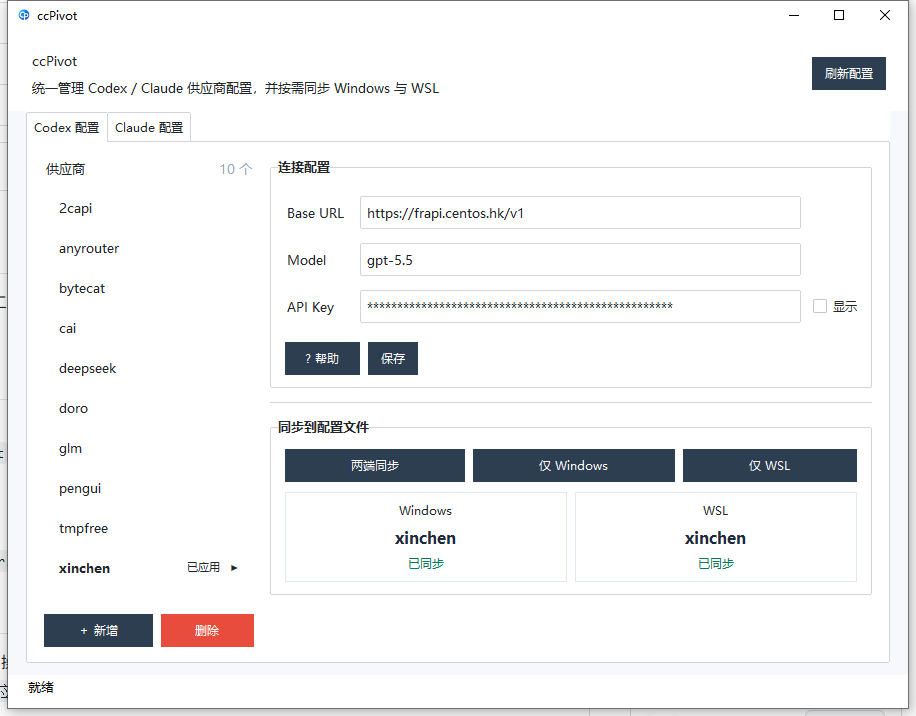

# ccPivot

<p align="center">
  
</p>

轻量级 AI Agent 自定义供应商管理工具 — 更优雅、更简洁地管理 Codex 与 Claude 的多套供应商配置。



## 定位

市面上的 AI 配置工具普遍臃肿、交互繁琐。**ccPivot** 专注于一件事：让你在 Windows / WSL 之间**流畅切换** Codex 和 Claude 的供应商配置。

- **轻量** — 单文件 Python 脚本，不依赖重型框架
- **直观** — 左右分栏布局，供应商列表一目了然
- **敏捷** — 一键同步到 Windows、WSL 或两端

## 安装

### 环境要求

- Windows 10+

### 安装步骤

```bash
# 1. 克隆仓库
git clone <repo-url>
cd tool

# 2. 双击 ccPivot.exe 即可使用
```

> `ccPivot.exe` 是自包含的可执行文件，内置 Python 解释器及所有依赖（tkinter、toml、ttkbootstrap），无需额外安装任何环境。

### 开发环境

如需从源码运行或修改代码：

```bash
# 安装依赖
pip install toml ttkbootstrap

# 或双击运行
install_dependencies.bat

# 启动
python config_switcher.py
```

重新构建 exe：

```bash
pip install pyinstaller
pyinstaller --onefile --noconsole --name ccPivot config_switcher.py
# 构建产物在 dist/ccPivot.exe
```

## 功能概览

| 功能 | Codex | Claude |
|------|-------|--------|
| 供应商 CRUD | ✓ | ✓ |
| Base URL / Model / API Key 配置 | ✓ | ✓ |
| 应用到 Windows | ✓ | ✓ |
| 应用到 WSL | ✓ | ✓ |
| 两端同步 | ✓ | ✓ |
| 自动备份（.backup） | ✓ | ✓ |
| 实时状态卡片 | ✓ | ✓ |

## 使用指南

### Codex 配置

管理 `~/.codex/config.toml` 的 `[model_providers.<name>]` 段落：

1. 点击左侧列表选择供应商
2. 在右侧表单填写 Base URL / Model / API Key
3. 点击「保存」存储到本地供应商档案
4. 点击「两端同步」写入配置文件并同步到 WSL

### Claude 配置

管理 `~/.claude/settings.json` 的 `env` 字段 (`ANTHROPIC_AUTH_TOKEN` / `ANTHROPIC_BASE_URL` / `ANTHROPIC_MODEL`)：

1. 切换到「Claude 配置」标签页
2. 操作方式与 Codex 标签页一致
3. 配置直接写入 `settings.json` 的 `env` 段落

### 同步选项

| 按钮 | 行为 |
|------|------|
| **两端同步** | 先保存当前输入，再同时写入 Windows 和 WSL |
| **仅 Windows** | 只修改 Windows 侧配置文件，不动 WSL |
| **仅 WSL** | 只修改 WSL 侧配置文件，不动 Windows |

底部状态卡片实时显示各端当前生效的供应商名称及其同步状态。

## 配置文件位置

### Windows

| 配置 | 路径 |
|------|------|
| Codex 主配置 | `%USERPROFILE%\.codex\config.toml` |
| Codex 认证 | `%USERPROFILE%\.codex\auth.json` |
| Claude 配置 | `%USERPROFILE%\.claude\settings.json` |
| 供应商档案 | `%USERPROFILE%\.config_switcher\providers.json` |

### WSL（自动检测）

| 配置 | 路径 |
|------|------|
| Codex 主配置 | `$HOME/.codex/config.toml` |
| Codex 认证 | `$HOME/.codex/auth.json` |
| Claude 配置 | `$HOME/.claude/settings.json` |

## 安全策略

- 每次写入配置前自动创建 `.backup` 备份文件
- API Key 输入框默认遮蔽显示，可通过「显示」复选框查看
- WSL 不可用时自动跳过同步，不影响 Windows 侧操作

## 开发

```bash
# 运行测试
python -m unittest discover -s tests -v

# 语法检查
python -m py_compile config_switcher.py

# 构建 exe（需要 pyinstaller）
pip install pyinstaller
pyinstaller --onefile --noconsole --name ccPivot config_switcher.py
```

## License

MIT
